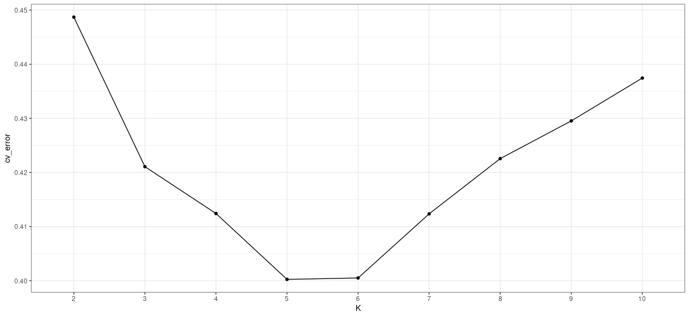
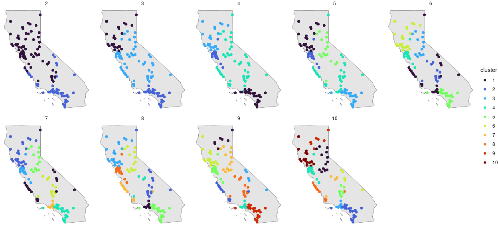
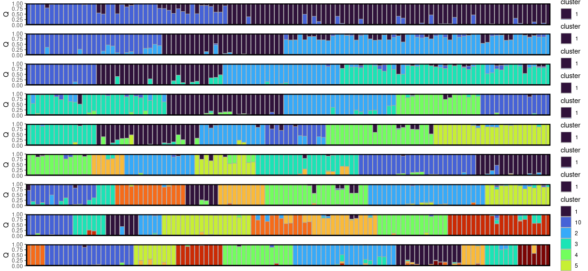
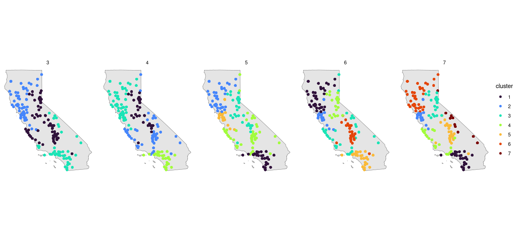
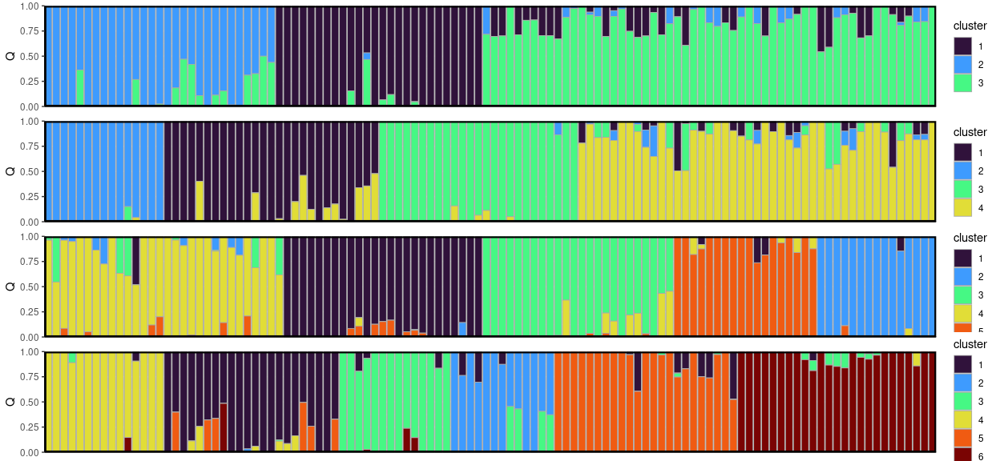
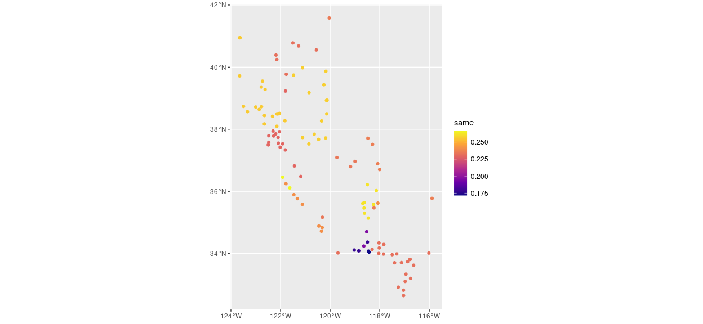

Admixture analysis
================

  - [2. ADMIXTURE](#2-admixture)

# 2\. ADMIXTURE

``` r
cv <- get_cv()
```

``` r
ggplot(cv, aes(x = K, y = cv_error, group = 1)) +
  geom_point() +
  geom_line() +
  theme_bw()
```

<!-- -->

``` r
# join with coords
Kvals <- c(2:10)
Q <-
 map(Kvals, ~get_Q(K = .x) %>% 
 mutate(K = .x)) %>%
 bind_rows() %>%
 arrange(across(starts_with("V"))) %>%
 mutate(SampleID = factor(SampleID, levels = unique(SampleID))) %>%
 pivot_longer(starts_with("V"), names_to = "PopGroup", values_to = "Q")
 
df <-
 left_join(Q, coords[,c("x", "y", "SampleID")], by = "SampleID") %>%
 st_as_sf(coords = c("x", "y")) %>%
 st_set_crs(st_crs(4326)) 

ggplot(df) +
  geom_sf(data = ca) +
  geom_sf(aes(col = cluster)) +
  facet_wrap(~K, nrow = 2) +
  theme_void() +
  scale_color_manual(values = viridis::turbo(max(Kvals))) 
```

<!-- -->

``` r
barplots <- map(Kvals, ~structure_plot(qmat = get_Q(K = .x, qmat_only = TRUE)) + scale_fill_manual(values = viridis::turbo(max(Kvals))))
do.call(ggarrange, c(barplots, ncol = 1))
```

<!-- -->

``` r
ggplot(filter(df, K %in% 3:6)) +
  geom_sf(data = ca) +
  geom_sf(aes(col = cluster)) +
  facet_wrap(~K, nrow = 1) +
  theme_void() +
  scale_color_manual(values = viridis::turbo(6))
```

<!-- -->

``` r
barplots <- map(3:6, ~structure_plot(qmat = get_Q(K = .x, qmat_only = TRUE)) + scale_fill_manual(values = viridis::turbo(6)))
do.call(ggarrange, c(barplots, ncol = 1))
```

<!-- -->

``` r
# write out population files
Q %>%
  filter(K == 5, PopGroup == "V1") %>%
  mutate(pop = paste0("pop", cluster)) %>%
  group_by(cluster) %>%
  group_split() %>%
  map(~as.character(pull(.x, SampleID))) %>%
  imap(\(x, idx) write(x, here("analysis", "admixture", "outputs", paste0("pop", idx, ".txt"))))
```

    ## [[1]]
    ## NULL
    ## 
    ## [[2]]
    ## NULL
    ## 
    ## [[3]]
    ## NULL
    ## 
    ## [[4]]
    ## NULL
    ## 
    ## [[5]]
    ## NULL

``` r
# simplified df with only cluster assignments and not Q values
simplified_df <- 
  df %>%
  # doesn't matter which pop group is selected, cluster is repeated
  filter(PopGroup == "V1") %>%
  dplyr::select(SampleID, cluster, K)

IDs <- unique(simplified_df$SampleID)

same_all_df <-
  map(IDs, ~{
    pop <- 
      simplified_df %>%
      filter(SampleID == .x) %>%
      st_drop_geometry() %>%
      rename(reference_cluster = cluster, reference_id = SampleID)

    same_df <-
      simplified_df %>%
      left_join(pop, by = "K") %>%
      mutate(same = (cluster == reference_cluster)) %>%
      group_by(SampleID, reference_id) %>%
      summarize(same = mean(same), .groups = "drop")

    return(same_df)
  }) %>% 
  bind_rows()

same_summarize_df <-
  same_all_df %>%
  group_by(SampleID) %>%
  summarize(same = mean(same), .groups = "drop")

ggplot(same_summarize_df) +
  geom_sf(aes(col = same)) +
  scale_color_viridis_c(option = "plasma")
```

<!-- -->
