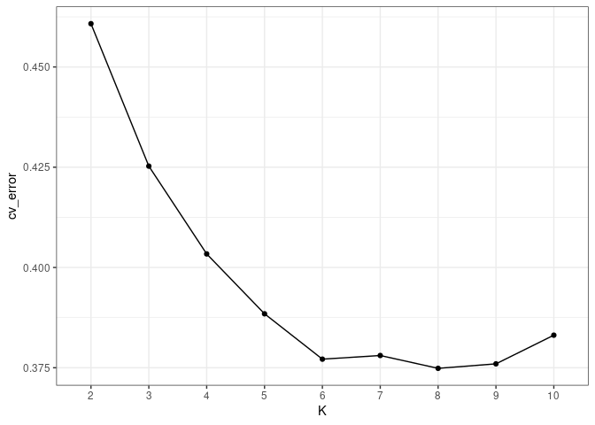
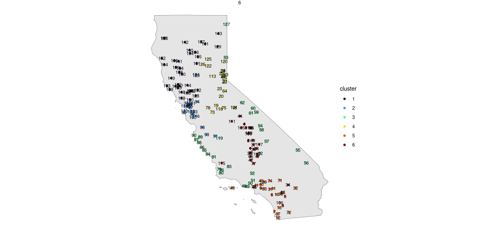
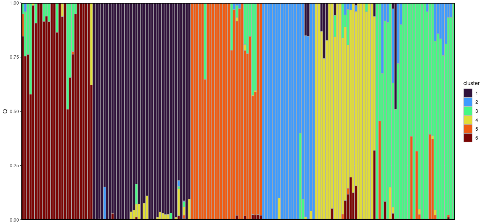
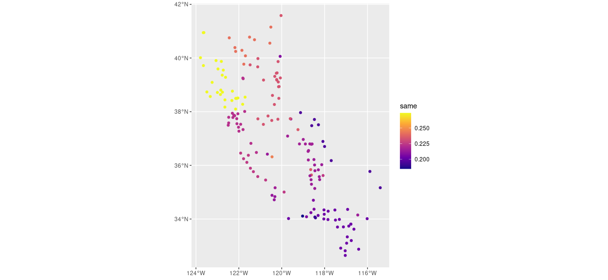
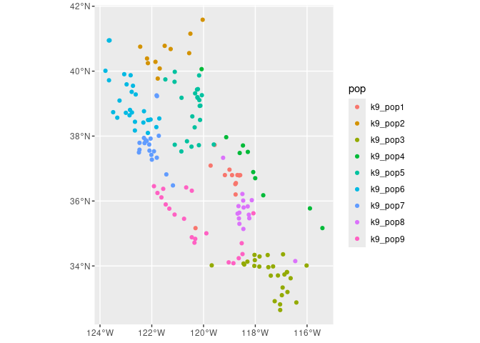

Admixture analysis
================

  - [2. ADMIXTURE](#2-admixture)
  - [Write out individuals](#write-out-individuals)

# 2\. ADMIXTURE

``` r
cv <- get_cv()
ggplot(cv, aes(x = K, y = cv_error, group = 1)) +
  geom_point() +
  geom_line() +
  theme_bw()
```

<!-- -->

``` r
# join with coords
Kvals <- c(2:10)
Q <-
 map(Kvals, ~get_Q(K = .x) %>% 
 mutate(K = .x)) %>%
 bind_rows() %>%
 arrange(across(starts_with("V"))) %>%
 mutate(SampleID = factor(SampleID, levels = unique(SampleID))) %>%
 pivot_longer(starts_with("V"), names_to = "PopGroup", values_to = "Q")
 
df <-
 left_join(Q, coords[,c("x", "y", "SampleID")], by = "SampleID") %>%
 st_as_sf(coords = c("x", "y")) %>%
 st_set_crs(st_crs(4326))

pdf(here("analysis", "admixture", "admixture.pdf"), width =10, height = 10)
ggplot(df) +
  geom_sf(data = ca) +
  geom_sf(aes(col = cluster)) +
  facet_wrap(~K, nrow = 2) +
  theme_void() +
  scale_color_manual(values = viridis::turbo(max(Kvals))) 
dev.off()
```

    ## png 
    ##   2

``` r
barplots <- map(Kvals, ~structure_plot(qmat = get_Q(K = .x, qmat_only = TRUE)) + scale_fill_manual(values = viridis::turbo(max(Kvals))))
do.call(ggarrange, c(barplots, ncol = 1))
```

<!-- -->

``` r
ggplot(filter(df, K %in% 3:7)) +
  geom_sf(data = ca) +
  geom_sf(aes(col = cluster)) +
  facet_wrap(~K, nrow = 1) +
  theme_void() +
  scale_color_manual(values = viridis::turbo(7))
```

<!-- -->

``` r
barplots <- map(3:6, ~structure_plot(qmat = get_Q(K = .x, qmat_only = TRUE)) + scale_fill_manual(values = viridis::turbo(7)))
do.call(ggarrange, c(barplots, ncol = 1))
```

<!-- -->

``` r
a <- filter(df, K == 6, PopGroup == "V1") %>% mutate(row = 1:nrow(.))
ggplot(a) +
  geom_sf(data = ca) +
  geom_sf(aes(col = cluster)) +
  geom_text(aes(label = row, x = st_coordinates(a)[,1], y =  st_coordinates(a)[,2]), size = 3) +
  facet_wrap(~K, nrow = 1) +
  theme_void() +
  scale_color_manual(values = viridis::turbo(6))
```

<!-- -->

``` r
filter(a, row == 45) %>% pull(SampleID)
```

    ## [1] "Scelocci_CCGPMC_MW01-3-14"

``` r
barplots <- map(6, ~structure_plot(qmat = get_Q(K = .x, qmat_only = TRUE)) + scale_fill_manual(values = viridis::turbo(6)))
do.call(ggarrange, c(barplots, ncol = 1))
```

<!-- -->

``` r
# FOR LINEAR MODELS: 
# Write out Q files for K = 6
# cluster = final cluster assignment for SampleID given max Q
# PopGroup = Q values for each cluster
Q %>% 
  filter(K == 6) %>% 
  write_csv(here("analysis", "admixture", "outputs", "Q6.csv"))

# write out Q values for the assigned population for Q = 6
Q %>%
  filter(K == 6) %>%
  # only keep the pop group/Q values corresponding to the cluster
  mutate(PopGroup = as.numeric(gsub("V", "", PopGroup))) %>%
  filter(cluster == PopGroup) %>%
  mutate(pop = paste0("pop", cluster)) %>%
  group_by(cluster) %>%
  group_split() %>%
  map(~as.character(pull(.x, SampleID))) %>%
  iwalk(\(x, idx) write(x, here("analysis", "admixture", "outputs", paste0("pop", idx, ".txt"))))
```

``` r
# Check for consistency
# simplified df with only cluster assignments and not Q values
simplified_df <- 
  df %>%
  # doesn't matter which pop group is selected, cluster is repeated
  filter(PopGroup == "V1") %>%
  dplyr::select(SampleID, cluster, K)
IDs <- unique(simplified_df$SampleID)

same_all_df <-
  map(IDs, ~{
    pop <- 
      simplified_df %>%
      filter(SampleID == .x) %>%
      st_drop_geometry() %>%
      rename(reference_cluster = cluster, reference_id = SampleID)
    same_df <-
      simplified_df %>%
      left_join(pop, by = "K") %>%
      mutate(same = (cluster == reference_cluster)) %>%
      group_by(SampleID, reference_id) %>%
      summarize(same = mean(same), .groups = "drop")
    return(same_df)
  }) %>% 
  bind_rows()
same_summarize_df <-
  same_all_df %>%
  group_by(SampleID) %>%
  summarize(same = mean(same), .groups = "drop")
ggplot(same_summarize_df) +
  geom_sf(aes(col = same)) +
  scale_color_viridis_c(option = "plasma")
```

<!-- -->

# Write out individuals

``` r
library(here)
library(tidyverse)
library(sf)
source(here("analysis", "admixture", "admixture.R"))
source(here("general_functions.R"))
# FOR ROH/SMCPP:
# Write out individual pop assignments for Q = 7
get_Q(K = 7) %>% 
  group_by(cluster) %>% 
  group_split() %>%
  iwalk(\(x, idx) write(x$SampleID, here("analysis", "admixture", "outputs", paste0("k7_pop", idx, ".txt"))))

# Write out individual pop assignments for Q = 9
get_Q(K = 9) %>% 
  group_by(cluster) %>% 
  group_split() %>%
  iwalk(\(x, idx) write(x$SampleID, here("analysis", "admixture", "outputs", paste0("k9_pop", idx, ".txt"))))

# Write out individual pop assignments for Q = 6
get_Q(K = 6) %>% 
  group_by(cluster) %>% 
  group_split() %>%
  iwalk(\(x, idx) write(x$SampleID, here("analysis", "admixture", "outputs", paste0("k6_pop", idx, ".txt"))))

# Check population locations
# Read in files and bind with coords 
pop_files <- list.files(here("analysis", "admixture", "outputs"), full.names = TRUE, pattern = "k9")
coords <- get_coords()
pop_df <- 
  map(pop_files, ~{
    pop <- read_lines(.x)
    pop_df <- tibble(SampleID = pop, pop = basename(.x) %>% gsub(".txt", "", .))
    return(pop_df)
  }) %>%
  bind_rows() %>%
  left_join(coords, by = "SampleID") %>%
  st_as_sf(coords = c("x", "y")) %>%
  st_set_crs(st_crs(4326))

ggplot(pop_df) +
  geom_sf(aes(col = pop))
```

<!-- -->
