Genetic diversity
================

  - [Heterozygosity](#heterozygosity)
  - [ROH](#roh)
  - [Models](#models)

# Heterozygosity

``` r
# get het data
het <- get_het()

# Combine coords and het data
coords <- left_join(coords, het, by = "SampleID") 

ggplot() + 
  geom_sf(data = ca) +
  geom_sf(data = coords, aes(col = Ho), cex = 3) +
  scale_color_viridis_c(option = "mako") +
  theme_void()
```

<!-- -->

``` r
ggplot(coords) +
 geom_sf() +
 geom_raster(data = dem, aes(x = x, y = y, fill = elev)) + 
 geom_sf(aes(geometry = geometry, col = Ho), pch = 16, cex = 2.5) +
 scale_color_viridis_c(option = "mako", labels = scales::label_number(scale = 1, accuracy = 0.001)) +
 scale_fill_gradient(low = "black", high = "white", na.value = NA) +
 theme_void()
```

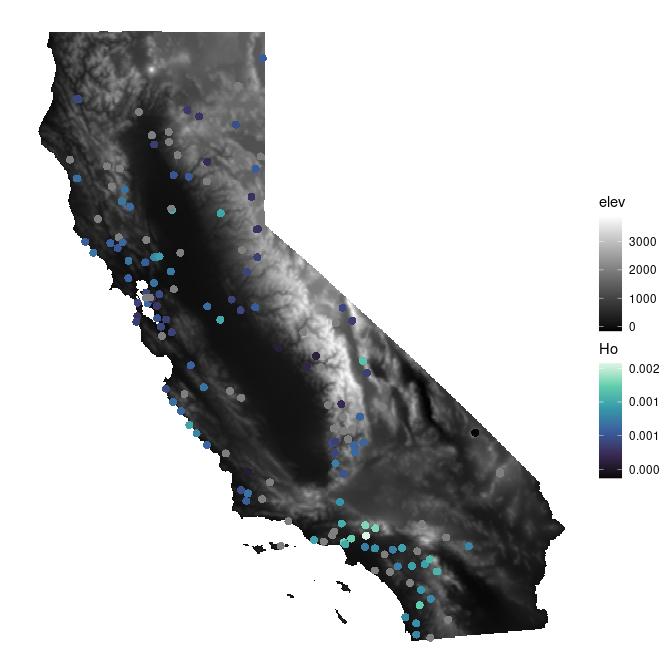<!-- -->

``` r
coords_proj <- st_transform(coords, 3310)
ca_proj <- st_transform(ca, 3310)
lyr <- coords_to_raster(coords_proj, buffer = 1, res = 10000)
window_Ho <- window_general(coords_proj$Ho, coords = coords_proj, lyr = lyr, wdim = 9, stat = mean, na.rm = TRUE)
ggplot_gd(window_Ho, bkg = ca_proj, col = magma(100))
krig_Ho <- krig_gd(window_Ho, grd = lyr, disagg_grd = 2)
mask_Ho <- mask_gd(krig_Ho, ca_proj, minval = 2)
ggplot_gd(mask_Ho, bkg = ca_proj, col = magma(100))
```

# ROH

``` r
roh_df <- get_roh()

ggplot(roh_df) +
 geom_sf(data = ca) +
 geom_sf(aes(geometry = geometry, fill = froh), col = "black", pch = 21, cex = 2.5) +
 scale_fill_viridis_c(option = "inferno", labels = scales::label_number(scale = 1, accuracy = 0.001)) +
 theme_void()
```

<!-- -->

``` r
ggplot(roh_df) +
 geom_sf(data = ca) +
 geom_sf(aes(geometry = geometry, fill = froh), col = "black", pch = 21, cex = 2.5) +
 labs(fill = "froh\n(log color scale)") +
 scale_fill_viridis_c(option = "inferno",  trans = "log", labels = scales::label_number(scale = 1, accuracy = 0.001)) +
 theme_void()
```

<!-- -->

``` r
ggplot(roh_df) +
 geom_sf(data = ca) +
 geom_sf(aes(geometry = geometry, col = pop), cex = 2.5) +
 theme_void()
```

<!-- -->

``` r
ggplot(roh_df) +
 geom_sf(data = ca) +
 geom_raster(data = dem, aes(x = x, y = y, fill = elev)) + 
 geom_sf(aes(geometry = geometry, col = froh), pch = 16, cex = 2.5) +
 scale_color_viridis_c(option = "inferno", trans = "log", labels = scales::label_number(scale = 1, accuracy = 0.001)) +
 scale_fill_gradient(low = "black", high = "white", na.value = NA) +
 theme_void()
```

<!-- -->

# Models

``` r
envdata <- get_env()
mod_df <- 
  left_join(roh_df, envdata) %>%
  left_join(het) %>%
  st_drop_geometry() %>%
  mutate(froh0_log = log(froh0 + 1)) %>%
  drop_na(froh0, Ho, elevation)

mod_div <- lm(froh0_log ~ Ho + elevation, data = mod_df)
summary(mod_div)
```

    ## 
    ## Call:
    ## lm(formula = froh0_log ~ Ho + elevation, data = mod_df)
    ## 
    ## Residuals:
    ##       Min        1Q    Median        3Q       Max 
    ## -0.019276 -0.007431 -0.002658  0.002583  0.069339 
    ## 
    ## Coefficients:
    ##               Estimate Std. Error t value Pr(>|t|)    
    ## (Intercept)  3.913e-02  5.184e-03   7.548 1.68e-11 ***
    ## Ho          -3.788e+01  5.228e+00  -7.245 7.55e-11 ***
    ## elevation    6.513e-06  1.876e-06   3.471 0.000753 ***
    ## ---
    ## Signif. codes:  0 '***' 0.001 '**' 0.01 '*' 0.05 '.' 0.1 ' ' 1
    ## 
    ## Residual standard error: 0.01309 on 105 degrees of freedom
    ## Multiple R-squared:  0.4128, Adjusted R-squared:  0.4017 
    ## F-statistic: 36.91 on 2 and 105 DF,  p-value: 7.239e-13

``` r
plot(mod_div)
```

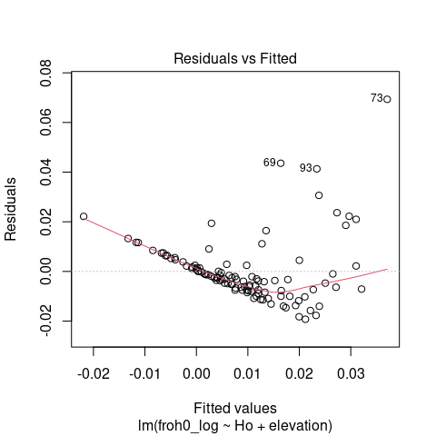<!-- -->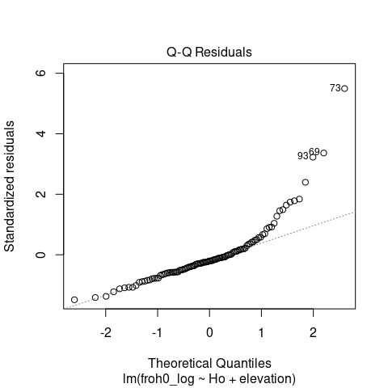<!-- -->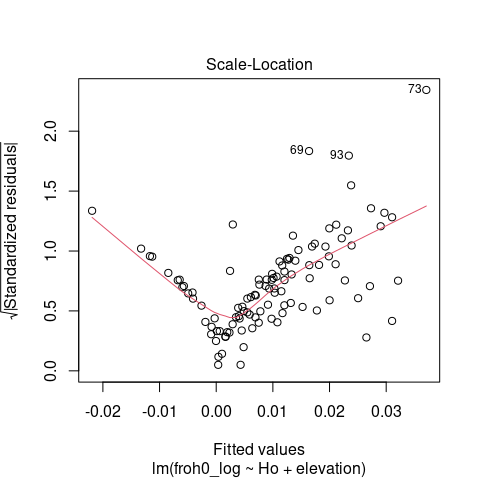<!-- -->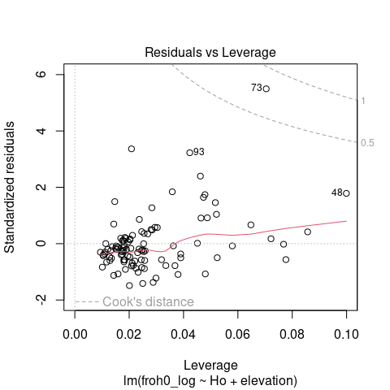<!-- -->

``` r
mod_df$fitted <- mod_div$fitted.values
ggplot(mod_df) +
  geom_point(aes(x = Ho, y = froh0_log, col = pop)) +
  theme_classic()
```

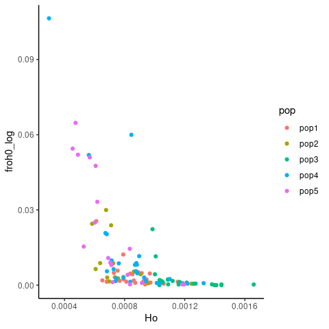<!-- -->

``` r
ggplot(mod_df) +
  geom_point(aes(x = fitted, y = froh0_log, col = pop)) +
  theme_classic()
```

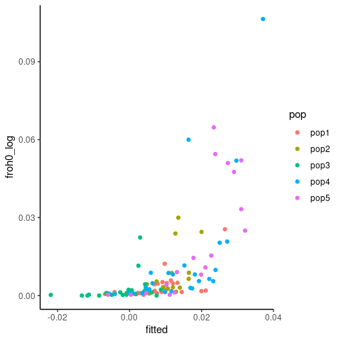<!-- -->

``` r
# Climate model:
mod_clim <- lm(froh0_log ~ CA_rPCA1 + CA_rPCA2 + CA_rPCA3, data = mod_df)
summary(mod_clim)
```

    ## 
    ## Call:
    ## lm(formula = froh0_log ~ CA_rPCA1 + CA_rPCA2 + CA_rPCA3, data = mod_df)
    ## 
    ## Residuals:
    ##       Min        1Q    Median        3Q       Max 
    ## -0.020546 -0.006838 -0.003465  0.000223  0.088863 
    ## 
    ## Coefficients:
    ##              Estimate Std. Error t value Pr(>|t|)    
    ## (Intercept)  0.015490   0.002455   6.310 6.95e-09 ***
    ## CA_rPCA1     0.003170   0.001438   2.204   0.0297 *  
    ## CA_rPCA2    -0.004012   0.001556  -2.578   0.0113 *  
    ## CA_rPCA3     0.001473   0.002084   0.707   0.4813    
    ## ---
    ## Signif. codes:  0 '***' 0.001 '**' 0.01 '*' 0.05 '.' 0.1 ' ' 1
    ## 
    ## Residual standard error: 0.01582 on 104 degrees of freedom
    ## Multiple R-squared:  0.1504, Adjusted R-squared:  0.1259 
    ## F-statistic: 6.138 on 3 and 104 DF,  p-value: 0.0006958

``` r
mod_clim2 <- lm(froh0_log ~ CA_rPCA2 , data = mod_df)
summary(mod_clim2)
```

    ## 
    ## Call:
    ## lm(formula = froh0_log ~ CA_rPCA2, data = mod_df)
    ## 
    ## Residuals:
    ##       Min        1Q    Median        3Q       Max 
    ## -0.019130 -0.008127 -0.004146  0.000837  0.085373 
    ## 
    ## Coefficients:
    ##              Estimate Std. Error t value Pr(>|t|)    
    ## (Intercept)  0.015473   0.002530   6.117 1.63e-08 ***
    ## CA_rPCA2    -0.004728   0.001566  -3.019  0.00317 ** 
    ## ---
    ## Signif. codes:  0 '***' 0.001 '**' 0.01 '*' 0.05 '.' 0.1 ' ' 1
    ## 
    ## Residual standard error: 0.01631 on 106 degrees of freedom
    ## Multiple R-squared:  0.0792, Adjusted R-squared:  0.07051 
    ## F-statistic: 9.117 on 1 and 106 DF,  p-value: 0.003173

``` r
# Elevation model:
mod_elev <- lm(froh0_log ~ elevation, data = mod_df)
summary(mod_elev)
```

    ## 
    ## Call:
    ## lm(formula = froh0_log ~ elevation, data = mod_df)
    ## 
    ## Residuals:
    ##       Min        1Q    Median        3Q       Max 
    ## -0.018953 -0.006747 -0.003362  0.000449  0.090519 
    ## 
    ## Coefficients:
    ##              Estimate Std. Error t value Pr(>|t|)    
    ## (Intercept) 3.803e-03  2.145e-03   1.773 0.079147 .  
    ## elevation   8.567e-06  2.261e-06   3.790 0.000251 ***
    ## ---
    ## Signif. codes:  0 '***' 0.001 '**' 0.01 '*' 0.05 '.' 0.1 ' ' 1
    ## 
    ## Residual standard error: 0.01595 on 106 degrees of freedom
    ## Multiple R-squared:  0.1193, Adjusted R-squared:  0.111 
    ## F-statistic: 14.36 on 1 and 106 DF,  p-value: 0.0002508

``` r
# Elevation and CA_rPCA2 are correlated
mat <- as.matrix(drop_na(mod_df[,c("CA_rPCA1", "CA_rPCA2", "CA_rPCA3", "elevation")]))
mod_clim_elev <- lm(froh0_log ~ CA_rPCA1 + elevation + CA_rPCA3, data = mod_df)
summary(mod_clim_elev)
```

    ## 
    ## Call:
    ## lm(formula = froh0_log ~ CA_rPCA1 + elevation + CA_rPCA3, data = mod_df)
    ## 
    ## Residuals:
    ##       Min        1Q    Median        3Q       Max 
    ## -0.018320 -0.006162 -0.003565 -0.000843  0.093961 
    ## 
    ## Coefficients:
    ##               Estimate Std. Error t value Pr(>|t|)  
    ## (Intercept)  5.370e-03  3.030e-03   1.772   0.0793 .
    ## CA_rPCA1     1.930e-03  1.580e-03   1.222   0.2246  
    ## elevation    6.657e-06  3.206e-06   2.076   0.0403 *
    ## CA_rPCA3    -5.826e-05  2.403e-03  -0.024   0.9807  
    ## ---
    ## Signif. codes:  0 '***' 0.001 '**' 0.01 '*' 0.05 '.' 0.1 ' ' 1
    ## 
    ## Residual standard error: 0.01599 on 104 degrees of freedom
    ## Multiple R-squared:  0.1321, Adjusted R-squared:  0.1071 
    ## F-statistic: 5.277 on 3 and 104 DF,  p-value: 0.001992

``` r
# Development and imperviousness model
mod_imperv <- lm(froh0_log ~ nlcd_imperviousness + elevation, data = mod_df)
summary(mod_imperv)
```

    ## 
    ## Call:
    ## lm(formula = froh0_log ~ nlcd_imperviousness + elevation, data = mod_df)
    ## 
    ## Residuals:
    ##       Min        1Q    Median        3Q       Max 
    ## -0.017362 -0.007030 -0.003727  0.001107  0.090355 
    ## 
    ## Coefficients:
    ##                       Estimate Std. Error t value Pr(>|t|)    
    ## (Intercept)          4.457e-03  2.408e-03   1.851 0.066950 .  
    ## nlcd_imperviousness -5.162e-05  8.525e-05  -0.605 0.546155    
    ## elevation            8.220e-06  2.339e-06   3.515 0.000651 ***
    ## ---
    ## Signif. codes:  0 '***' 0.001 '**' 0.01 '*' 0.05 '.' 0.1 ' ' 1
    ## 
    ## Residual standard error: 0.016 on 105 degrees of freedom
    ## Multiple R-squared:  0.1224, Adjusted R-squared:  0.1057 
    ## F-statistic: 7.321 on 2 and 105 DF,  p-value: 0.001055

``` r
mod_devel <- lm(froh0_log ~ developed + elevation, data = mod_df)
summary(mod_devel)
```

    ## 
    ## Call:
    ## lm(formula = froh0_log ~ developed + elevation, data = mod_df)
    ## 
    ## Residuals:
    ##       Min        1Q    Median        3Q       Max 
    ## -0.022558 -0.006478 -0.000836  0.006047  0.051081 
    ## 
    ## Coefficients:
    ##                                              Estimate Std. Error t value
    ## (Intercept)                                 1.490e-02  6.303e-03   2.364
    ## developedDeveloped - Medium Intensity      -1.359e-02  1.043e-02  -1.303
    ## developedDeveloped-Roads                   -1.428e-02  1.035e-02  -1.379
    ## developedDeveloped-Upland Deciduous Forest -1.950e-02  1.333e-02  -1.463
    ## developedDeveloped-Upland Evergreen Forest -3.955e-02  1.466e-02  -2.698
    ## developedDeveloped-Upland Herbaceous       -3.172e-02  1.183e-02  -2.682
    ## developedDeveloped-Upland Mixed Forest     -1.731e-02  1.327e-02  -1.305
    ## developedDeveloped-Upland Shrubland        -1.379e-02  9.120e-03  -1.512
    ## elevation                                   2.864e-05  8.784e-06   3.260
    ##                                            Pr(>|t|)   
    ## (Intercept)                                 0.02732 * 
    ## developedDeveloped - Medium Intensity       0.20616   
    ## developedDeveloped-Roads                    0.18183   
    ## developedDeveloped-Upland Deciduous Forest  0.15762   
    ## developedDeveloped-Upland Evergreen Forest  0.01312 * 
    ## developedDeveloped-Upland Herbaceous        0.01361 * 
    ## developedDeveloped-Upland Mixed Forest      0.20553   
    ## developedDeveloped-Upland Shrubland         0.14466   
    ## elevation                                   0.00358 **
    ## ---
    ## Signif. codes:  0 '***' 0.001 '**' 0.01 '*' 0.05 '.' 0.1 ' ' 1
    ## 
    ## Residual standard error: 0.01676 on 22 degrees of freedom
    ##   (77 observations deleted due to missingness)
    ## Multiple R-squared:  0.4518, Adjusted R-squared:  0.2524 
    ## F-statistic: 2.266 on 8 and 22 DF,  p-value: 0.06158

``` r
# Comparison of AIC suggests that elevation alone is the best model
AIC(mod_clim_elev)
```

    ## [1] -580.928

``` r
AIC(mod_clim)
```

    ## [1] -583.2315

``` r
AIC(mod_elev)
```

    ## [1] -583.3494

``` r
AIC(mod_clim2)
```

    ## [1] -578.5379

``` r
# plot of elevation vs roh
# doesn't seem suggestive of a strong relationship
ggplot(mod_df) +
  geom_point(aes(x = elevation, y = froh0_log, col = pop)) +
  theme_classic()
```

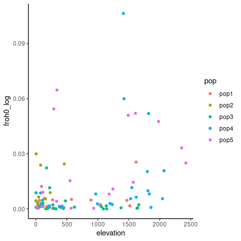<!-- -->

``` r
ggplot(mod_df) +
  geom_point(aes(x = CA_rPCA2, y = froh0_log, col = pop)) +
  theme_classic()
```

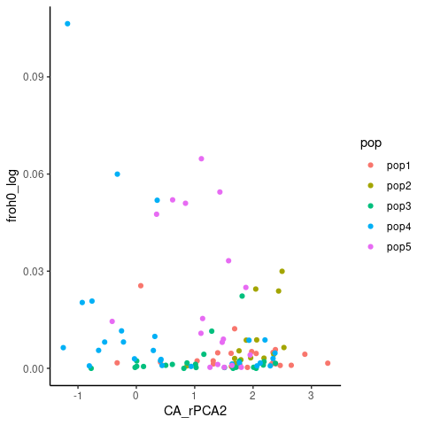<!-- -->

``` r
ggplot(mod_df) +
  geom_point(aes(x = CA_rPCA1, y = froh0_log, col = pop)) +
  theme_classic()
```

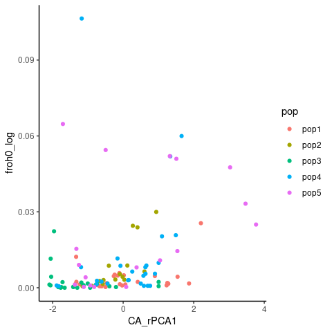<!-- -->

``` r
ggplot(mod_df) +
  geom_point(aes(x = CA_rPCA3, y = froh0_log, col = pop)) +
  theme_classic()
```

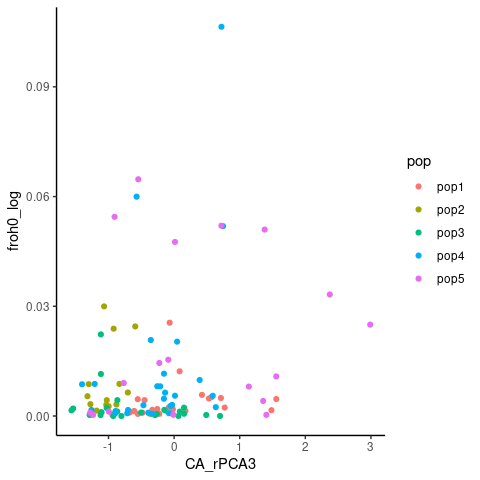<!-- -->
