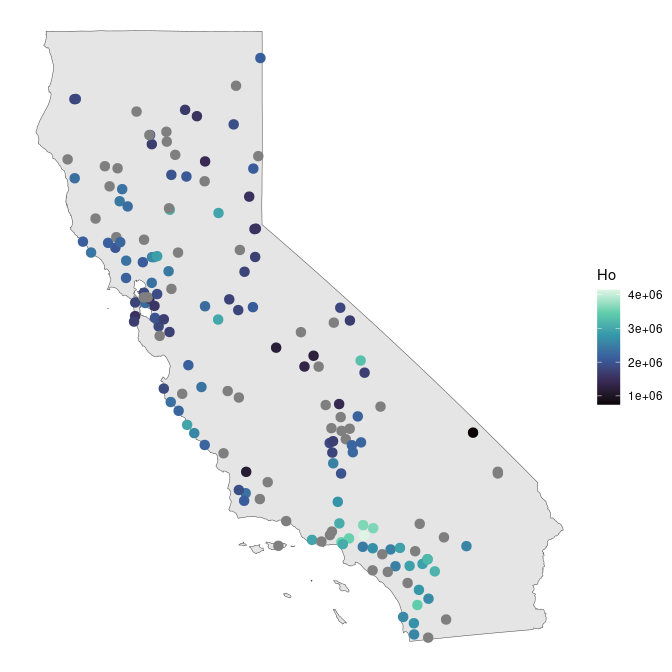
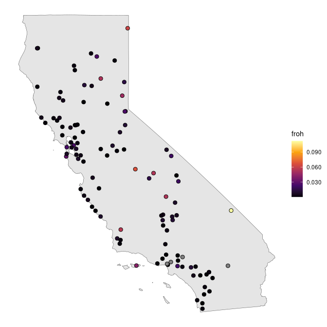
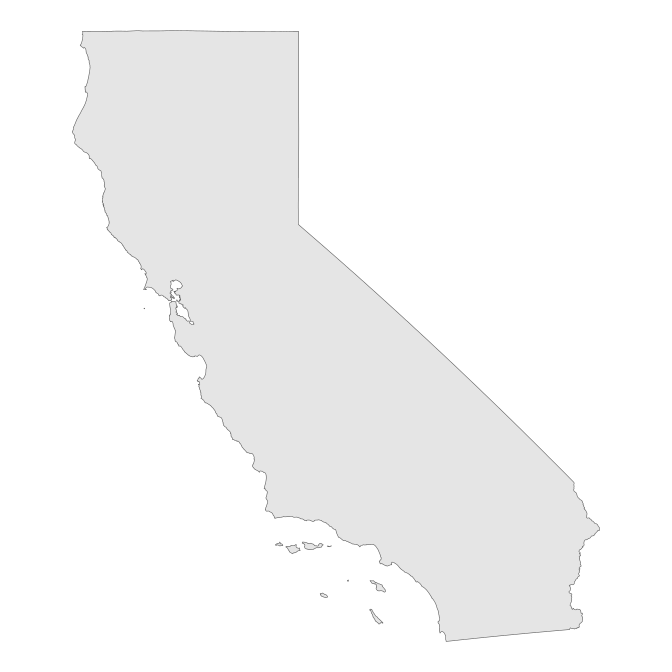
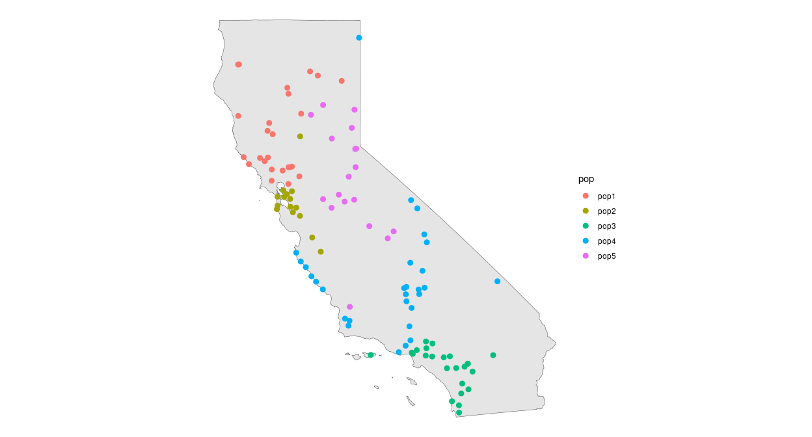
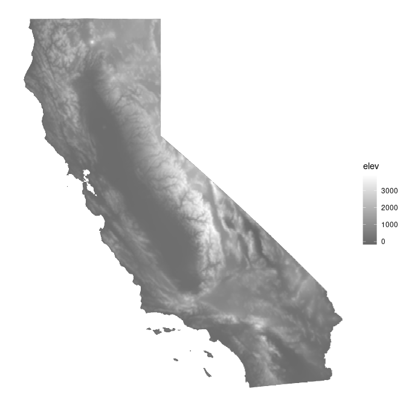

Genetic diversity
================

  - [Heterozygosity](#heterozygosity)
  - [ROH](#roh)
  - [Models](#models)

# Heterozygosity

``` r
# get het data
het <- get_het()

# Combine coords and het data
coords <- left_join(coords, het, by = "SampleID") 

ggplot() + 
  geom_sf(data = ca) +
  geom_sf(data = coords, aes(col = Ho), cex = 3) +
  scale_color_viridis_c(option = "mako") +
  theme_void()
```

<!-- -->

``` r
coords_proj <- st_transform(coords, 3310)
ca_proj <- st_transform(ca, 3310)
lyr <- coords_to_raster(coords_proj, buffer = 1, res = 10000)
window_Ho <- window_general(coords_proj$Ho, coords = coords_proj, lyr = lyr, wdim = 9, stat = mean, na.rm = TRUE)
ggplot_gd(window_Ho, bkg = ca_proj, col = magma(100))
krig_Ho <- krig_gd(window_Ho, grd = lyr, disagg_grd = 2)
mask_Ho <- mask_gd(krig_Ho, ca_proj, minval = 2)
ggplot_gd(mask_Ho, bkg = ca_proj, col = magma(100))
```

# ROH

``` r
roh_df <- get_roh()
dem <- get_dem()

ggplot(roh_df) +
 geom_sf(data = ca) +
 geom_sf(aes(geometry = geometry, fill = froh), col = "black", pch = 21, cex = 2.5) +
 scale_fill_viridis_c(option = "inferno", labels = scales::label_number(scale = 1, accuracy = 0.001)) +
 theme_void()
```

<!-- -->

``` r
ggplot(roh_df) +
 geom_sf(data = ca) +
 geom_sf(aes(geometry = geometry, fill = froh), col = "black", pch = 21, cex = 2.5) +
 labs(fill = "froh\n(log color scale)") +
 scale_fill_viridis_c(option = "inferno",  trans = "log", labels = scales::label_number(scale = 1, accuracy = 0.001)) +
 theme_void()
```

<!-- -->

``` r
ggplot(roh_df) +
 geom_sf(data = ca) +
 geom_sf(aes(geometry = geometry, col = pop), cex = 2.5) +
 theme_void()
```

<!-- -->

``` r
ggplot(roh_df) +
 geom_sf(data = ca) +
 geom_raster(data = dem, aes(x = x, y = y, fill = elev)) + 
 geom_sf(aes(geometry = geometry, col = froh), pch = 16, cex = 2.5) +
 scale_color_viridis_c(option = "inferno", trans = "log", labels = scales::label_number(scale = 1, accuracy = 0.001)) +
 scale_fill_gradient(low = "black", high = "white", na.value = NA) +
 theme_void()
```

<!-- -->

# Models

``` r
envdata <- get_env()
mod_df <- 
  left_join(roh_df, envdata) %>%
  st_drop_geometry() 

# Climate model:
mod_clim <- lm(froh0 ~ CA_rPCA1 + CA_rPCA2 + CA_rPCA3, data = mod_df)
summary(mod_clim)
mod_clim2 <- lm(froh0 ~ CA_rPCA2 , data = mod_df)
summary(mod_clim2)

# Elevation model:
mod_elev <- lm(froh0 ~ elevation, data = mod_df)
summary(mod_elev)

# Elevation and CA_rPCA2 are correlated
mat <- as.matrix(drop_na(mod_df[,c("CA_rPCA1", "CA_rPCA2", "CA_rPCA3", "elevation")]))
mod_clim_elev <- lm(froh0 ~ CA_rPCA1 + elevation + CA_rPCA3, data = mod_df)
summary(mod_clim_elev)

# Development and imperviousness model
mod_imperv <- lm(froh0 ~ nlcd_imperviousness, data = mod_df)
summary(mod_imperv)

mod_devel <- lm(froh0 ~ LF_evh_developed_bin, data = mod_df)
summary(mod_devel)

# Comparison of AIC suggests that elevation alone is the best model
AIC(mod_clim_elev)
AIC(mod_clim)
AIC(mod_elev)
AIC(mod_clim2)

# plot of elevation vs roh
# doesn't seem suggestive of a strong relationship
ggplot(mod_df) +
  geom_point(aes(x = elevation, y = froh0, col = pop)) +
  theme_classic()

ggplot(mod_df) +
  geom_point(aes(x = CA_rPCA2, y = froh0, col = pop)) +
  theme_classic()
```
