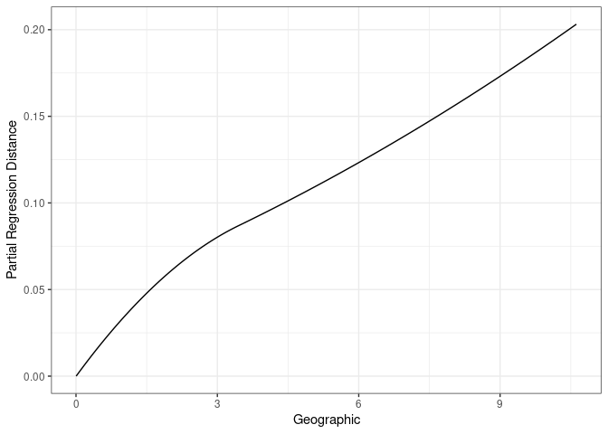
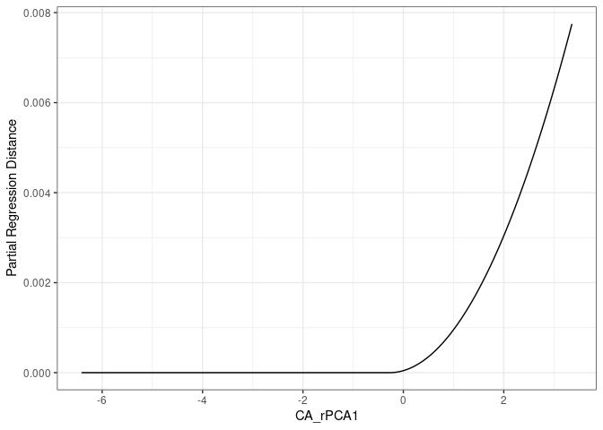
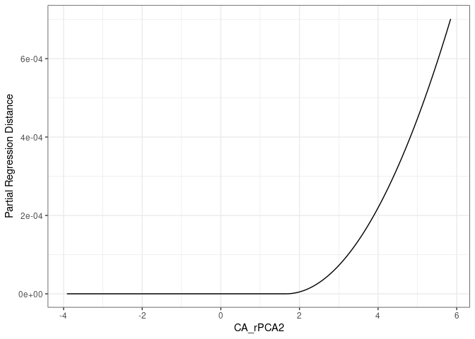
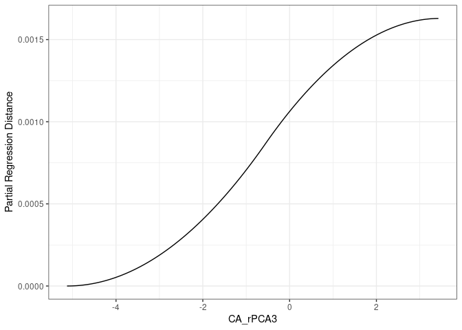
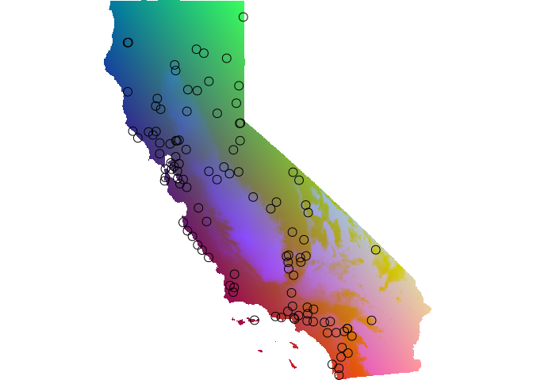
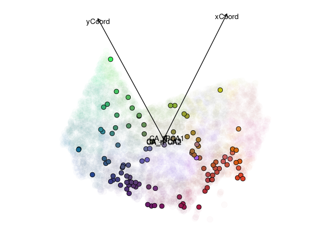
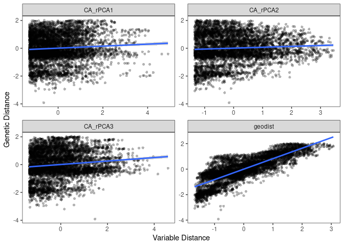
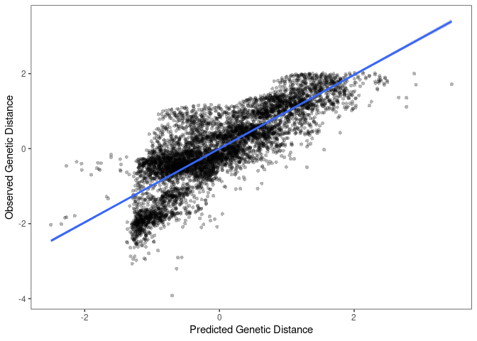
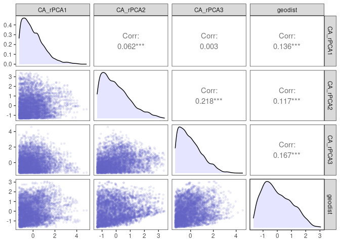

IBD/IBE analysis
================

  - [format genetic distances](#format-genetic-distances)
  - [GDM](#gdm)
  - [MMRR](#mmrr)

# format genetic distances

``` r
library(tidyverse)
library(here)
library(algatr)
source(here("general_functions.R"))
source(here("analysis", "ibdibe", "gendist.R"))

# Format distances and write out file
format_dist()
```

    ## wrote dist file to:/media/wanglab/798f0e01-89d1-4d0f-8ed8-ef323be70ab91/Anusha/GitHub/ccgpscelop/data/58-Sceloporus_dist.csv

``` r
# Load the U.S. state boundaries data
states <- states(cb = TRUE)
```

    ## Retrieving data for the year 2021

``` r
# Extract the boundary of California (CA)
ca <- states[states$STUSPS == "CA", "STUSPS"]

# sample coords
coords <- read_table(here("data/58-Sceloporus.coords.txt"), col_names = FALSE)
```

    ## 
    ## ── Column specification ─────────────────────────────────────────────────────────────────────────────────────────────
    ## cols(
    ##   X1 = col_character(),
    ##   X2 = col_double(),
    ##   X3 = col_double()
    ## )

``` r
colnames(coords) <- c("ID", "x", "y")
```

# GDM

``` r
load_algatr_example()
```

    ## 
    ## ---------------- example dataset ----------------
    ##  
    ## Objects loaded: 
    ## *liz_vcf* vcfR object (1000 loci x 53 samples) 
    ## *liz_gendist* genetic distance matrix (Plink Distance) 
    ## *liz_coords* dataframe with x and y coordinates 
    ## *CA_env* RasterStack with PC environmental layers 
    ## 
    ## -------------------------------------------------

    ## 

``` r
gendist <- get_gendist()

row.names(gendist)[!(row.names(gendist) %in% coords$ID)]
```

    ## [1] "Array"

``` r
i <- which(row.names(gendist) == "Array")
row.names(gendist)[i] <- colnames(gendist)[i] <- "Array#33"

row.names(gendist)[!(row.names(gendist) %in% coords$ID)]
```

    ## character(0)

``` r
gendist_coords <- 
  coords %>% 
  filter(ID %in% row.names(gendist)) %>%
  mutate(ID = factor(ID, levels = row.names(gendist))) %>%
  arrange(ID)

stopifnot(gendist_coords$ID == row.names(gendist))

gdm <- gdm_do_everything(gendist = gendist, coords = gendist_coords[,c("x", "y")], envlayers = CA_env, quiet = TRUE)
```

    ## Please be aware: the do_everything functions are meant to be exploratory. We do not recommend their use for final analyses unless certain they are properly parameterized.

    ## Warning in crs_check(coords, envlayers): No CRS found for the provided
    ## coordinates. Make sure the coordinates and the raster have the same projection
    ## (see function details or vignette)

    ## Warning in .f(...): 545 NA values found in gdmData, removing; 5671 values
    ## remain

``` r
print(gdm$coeff_df)
```

    ##    predictor  coefficient
    ## 1 Geographic 0.2041991831
    ## 2   CA_rPCA1 0.0079588406
    ## 3   CA_rPCA2 0.0007178817
    ## 4   CA_rPCA3 0.0016290682

``` r
gdm_plot_isplines(gdm$model)
```

<!-- --><!-- --><!-- --><!-- -->

``` r
gdm_map(gdm$model, CA_env, gendist_coords[,c("x", "y")])
```

<!-- -->

    ## Warning: Removed 5 rows containing missing values (`geom_point()`).

<!-- -->

    ## $rastTrans
    ## class       : SpatRaster 
    ## dimensions  : 1138, 1242, 5  (nrow, ncol, nlyr)
    ## resolution  : 0.008333333, 0.008333333  (x, y)
    ## extent      : -124.4833, -114.1333, 32.525, 42.00833  (xmin, xmax, ymin, ymax)
    ## coord. ref. : +proj=longlat +datum=WGS84 +no_defs 
    ## source(s)   : memory
    ## names       :    xCoord,    yCoord,    CA_rPCA1,     CA_rPCA2,    CA_rPCA3 
    ## min values  : 0.0000000, 0.0000000, 0.000000000, 0.0000000000, 0.000000000 
    ## max values  : 0.1974305, 0.1820463, 0.007958841, 0.0007178817, 0.001629068 
    ## 
    ## $pcaRastRGB
    ## class       : SpatRaster 
    ## dimensions  : 1138, 1242, 3  (nrow, ncol, nlyr)
    ## resolution  : 0.008333333, 0.008333333  (x, y)
    ## extent      : -124.4833, -114.1333, 32.525, 42.00833  (xmin, xmax, ymin, ymax)
    ## coord. ref. : +proj=longlat +datum=WGS84 +no_defs 
    ## source(s)   : memory
    ## names       : PC1, PC2, PC3 
    ## min values  :   0,   0,   0 
    ## max values  : 255, 255, 255

# MMRR

``` r
mmrr <- mmrr_do_everything(gendist = gendist, coords = gendist_coords[,c("x", "y")], env = CA_env, quiet = FALSE)
```

    ## Please be aware: the do_everything functions are meant to be exploratory. We do not recommend their use for final analyses unless certain they are properly parameterized.

    ## Warning in crs_check(coords, env): No CRS found for the provided coordinates.
    ## Make sure the coordinates and the raster have the same projection (see function
    ## details or vignette)

    ## Warning: Removed 1635 rows containing non-finite values (`stat_smooth()`).

    ## Warning: Removed 1635 rows containing missing values (`geom_point()`).

<!-- --><!-- -->

    ## Warning: Removed 545 rows containing non-finite values (`stat_density()`).

    ## Warning in ggally_statistic(data = data, mapping = mapping, na.rm = na.rm, :
    ## Removed 545 rows containing missing values
    
    ## Warning in ggally_statistic(data = data, mapping = mapping, na.rm = na.rm, :
    ## Removed 545 rows containing missing values
    
    ## Warning in ggally_statistic(data = data, mapping = mapping, na.rm = na.rm, :
    ## Removed 545 rows containing missing values

    ## Warning: Removed 545 rows containing missing values (`geom_point()`).

    ## Warning: Removed 545 rows containing non-finite values (`stat_density()`).

    ## Warning in ggally_statistic(data = data, mapping = mapping, na.rm = na.rm, :
    ## Removed 545 rows containing missing values
    
    ## Warning in ggally_statistic(data = data, mapping = mapping, na.rm = na.rm, :
    ## Removed 545 rows containing missing values

    ## Warning: Removed 545 rows containing missing values (`geom_point()`).
    ## Removed 545 rows containing missing values (`geom_point()`).

    ## Warning: Removed 545 rows containing non-finite values (`stat_density()`).

    ## Warning in ggally_statistic(data = data, mapping = mapping, na.rm = na.rm, :
    ## Removed 545 rows containing missing values

    ## Warning: Removed 545 rows containing missing values (`geom_point()`).
    ## Removed 545 rows containing missing values (`geom_point()`).
    ## Removed 545 rows containing missing values (`geom_point()`).

<!-- -->

``` r
print(mmrr$coeff_df)
```

    ##         var     estimate     p    95% Lower    95% Upper
    ## 1  CA_rPCA1 -0.039526330 0.014 -0.052193703 -0.026858957
    ## 2  CA_rPCA2 -0.029662881 0.049 -0.042565086 -0.016760676
    ## 3  CA_rPCA3 -0.008072419 0.603 -0.021055642  0.004910804
    ## 4   geodist  0.827852235 0.001  0.815069399  0.840635070
    ## 5 Intercept  0.005395324 0.428 -0.007133188  0.017923836
