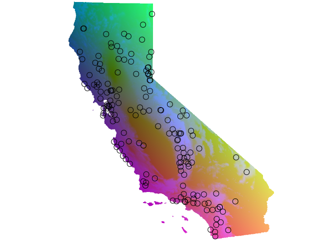
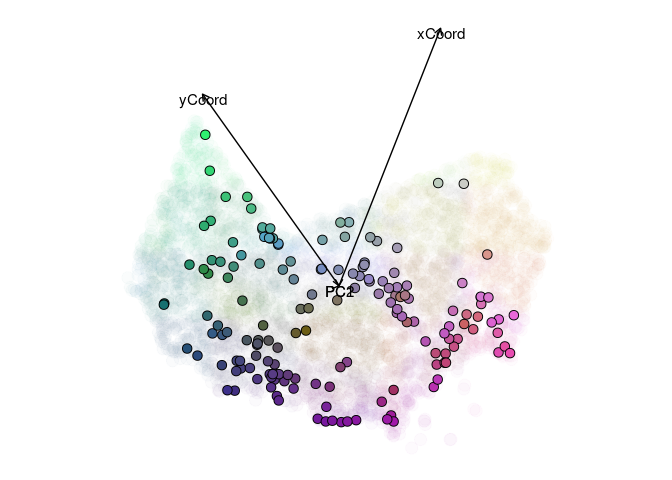
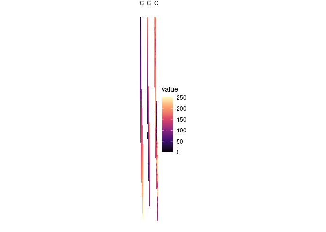
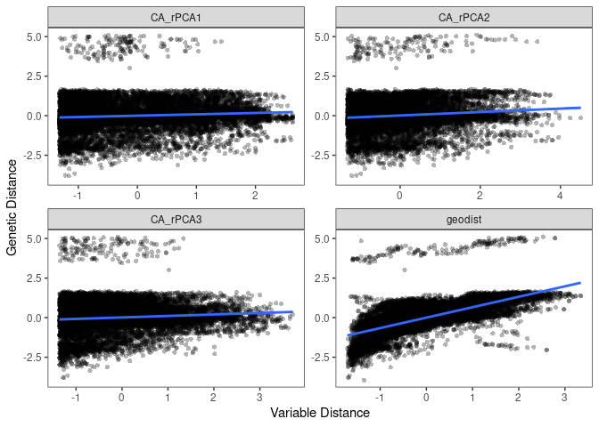
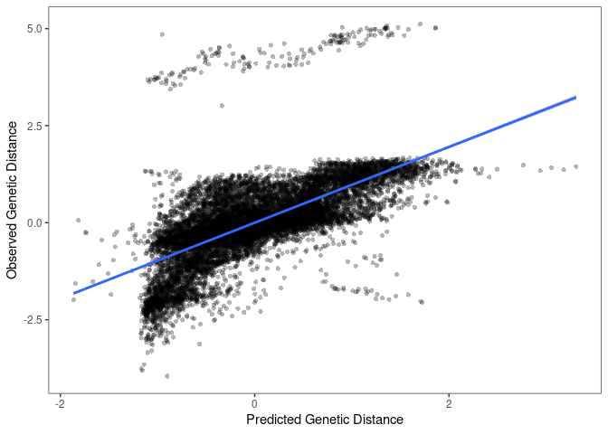
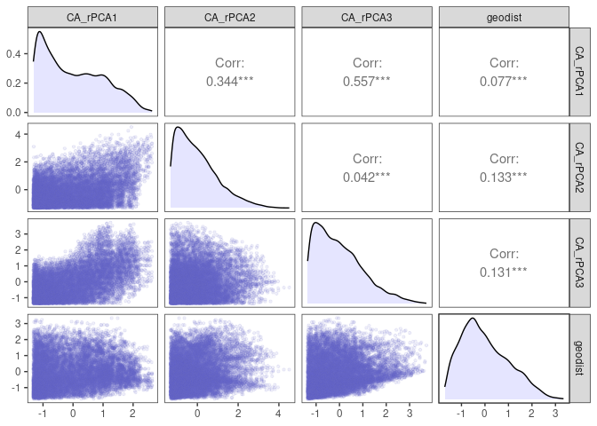

IBD/IBE analysis
================

# format genetic distances

``` r
library(tidyverse)
library(here)
library(algatr)
library(terra)
library(sf)
source(here("general_functions.R"))
source(here("analysis", "ibdibe", "gendist.R"))
```

``` r
# Format distances and write out file
format_dist()
```

    ## wrote dist file to:/media/wanglab/798f0e01-89d1-4d0f-8ed8-ef323be70ab9/Anusha/GitHub/ccgpscelop/data/58-Sceloporus_dist.csv

``` r
ca <- get_ca()
```

    ## Retrieving data for the year 2021

``` r
coords <- get_coords()
```

    ## 
    ## ── Column specification ─────────────────────────────────────────────────────────────────────────────────────────────────────────────
    ## cols(
    ##   X1 = col_character(),
    ##   X2 = col_double(),
    ##   X3 = col_double()
    ## )

# GDM

``` r
gendist <- get_gendist()

gendist_coords <- 
  coords %>% 
  filter(SampleID %in% row.names(gendist)) %>%
  mutate(SampleID = factor(SampleID, levels = row.names(gendist))) %>%
  arrange(SampleID)

stopifnot(gendist_coords$SampleID == row.names(gendist))
```

### Current

``` r
envstack <- rast(here("data", "env", "envstack.tif"))
names(envstack) <- c("CA_rPCA1", "CA_rPCA2", "CA_rPCA3", "elevation")
env_agg <- aggregate(envstack, 50)

coords_proj <- 
  gendist_coords[,c("x", "y")] %>% 
  st_as_sf(coords = c("x", "y"), crs = 4326) %>% 
  st_transform(3310)

env <- terra::extract(envstack[[c("CA_rPCA1", "CA_rPCA2", "CA_rPCA3")]], coords_proj, ID = FALSE)

gdm <- gdm_do_everything(gendist = gendist, coords = gendist_coords[,c("x", "y")], env = env, quiet = TRUE, scale_gendist=TRUE)
```

    ## Please be aware: the do_everything functions are meant to be exploratory. We do not recommend their use for final analyses unless certain they are properly parameterized.

    ## Warning in crs_check(coords, envlayers): No CRS found for the provided
    ## coordinates. Make sure the coordinates and the raster have the same projection
    ## (see function details or vignette)

    ## Warning in .f(...): 1268 NA values found in gdmData, removing; 11935 values
    ## remain

``` r
print(gdm$coeff_df)
```

    ##    predictor coefficient
    ## 1 Geographic  0.88562820
    ## 2   CA_rPCA1  0.03246345
    ## 3   CA_rPCA2  0.05970627
    ## 4   CA_rPCA3  0.00000000

``` r
gdm_plot_isplines(gdm$model)
```

<!-- -->

``` r
maps <- gdm_map(gdm$model, env_agg, coords_proj, plot_vars = FALSE)
```

    ## Warning in gdm::gdm.transform(gdm_model, envlayers_sub): Extracted data from
    ## rasters contained NAs. These were automatically removed from the data object to
    ## be transformed.

<!-- -->

``` r
plotRGB(maps$pcaRastRGB)
```

<!-- -->

``` r
#rgb_envonly <- stack_to_rgb(maps$rastTrans[[3:5]])
#plotRGB(rgb_envonly)
#points(coords_proj, pch = 1, cex = 1)

ggmaps <- as.data.frame(maps$pcaRastRGB, xy = TRUE) %>% pivot_longer(cols = -c(x, y), names_to = "variable", values_to = "value")
ggplot(ggmaps) +
  geom_sf(data = ca) +
  geom_raster(aes(x = x, y = y, fill = value)) +
  facet_wrap(~variable, nrow = 1) +
  scale_fill_viridis_c(option = "magma", na.value = NA) +
  theme_void()
```

<!-- -->

``` r
source(here("analysis", "ibdibe", "krast.R"))
#result <- test_krast(maps$rastTrans, agg = 10, k = 10)
result_k <- run_krast(maps$rastTrans, k = 5)
```

    ## Warning: Quick-TRANSfer stage steps exceeded maximum (= 1924750)

``` r
png(here("analysis", "ibdibe", "krast.png"))
plot_krast(result_k)
dev.off()
```

    ## png 
    ##   2

## Paleoclimate

``` r
envstack <- rast(here("data", "env", "paleoclim", "paleoclim.tif"))
lhstack <- envstack[[grepl("lh", names(envstack))]]
lhpcs <- RStoolbox::rasterPCA(lhstack, nComp = 3, scale = TRUE)
lhpcs <- lhpcs$map

coords_proj <- gendist_coords[,c("x", "y")] %>% st_as_sf(coords = c("x", "y"), crs = 4326) 
env <- terra::extract(lhpcs, coords_proj, ID = FALSE)

gdm_lh <- gdm_do_everything(gendist = gendist, coords = gendist_coords[,c("x", "y")], env = env, quiet = TRUE, scale_gendist = TRUE)

print(gdm_lh$coeff_df)

maps_lh <- gdm_map(gdm_lh$model, lhpcs, coords_proj, plot_vars = FALSE)

#rgb_envonly <- stack_to_rgb(maps_lh$rastTrans[[3:5]])
#rgb_envonly <- stack_to_rgb(maps_lh$rastTrans)
plotRGB(maps_lh$pcaRastRGB)
points(coords_proj, pch = 1, cex = 1)
```

``` r
curstack <- envstack[[grepl("cur", names(envstack))]]
curpcs <- RStoolbox::rasterPCA(curstack, nComp = 3, scale = TRUE)
curpcs <- curpcs$map

coords_proj <- gendist_coords[,c("x", "y")] %>% st_as_sf(coords = c("x", "y"), crs = 4326) 
env <- terra::extract(curpcs, coords_proj, ID = FALSE)

gdm_cur <- gdm_do_everything(gendist = gendist, coords = gendist_coords[,c("x", "y")], env = env, quiet = TRUE)

print(gdm_cur$coeff_df)

maps <- gdm_map(gdm_cur$model, curpcs, coords_proj, plot_vars = FALSE)
plotRGB(maps$pcaRastRGB)
points(coords_proj, pch = 1, cex = 1)
```

``` r
bio1 <- envstack[[grepl("lh_bio_1", names(envstack))]]

coords_proj <- gendist_coords[,c("x", "y")] %>% st_as_sf(coords = c("x", "y"), crs = 4326) 
env <- terra::extract(bio1, coords_proj, ID = FALSE)

gdm_bio1 <- gdm_do_everything(gendist = gendist, coords = gendist_coords[,c("x", "y")], env = env, quiet = TRUE, scale_gendist = TRUE)

print(gdm_bio1$coeff_df)

maps <- gdm_map(gdm_bio1$model, bio2, coords_proj, plot_vars = FALSE)
plotRGB(maps$pcaRastRGB)
points(coords_proj, pch = 1, cex = 1)
print(gdm_bio1$coeff_df)
```

``` r
print(gdm_cur$coeff_df)
print(gdm_lh$coeff_df)
```

# MMRR

``` r
coords_proj <- 
  gendist_coords[,c("x", "y")] %>% 
  st_as_sf(coords = c("x", "y"), crs = 4326) %>% 
  st_transform(3310)

env <- terra::extract(envstack[[c("CA_rPCA1", "CA_rPCA2", "CA_rPCA3")]], coords_proj, ID = FALSE)

mmrr <- mmrr_do_everything(gendist = gendist, coords = gendist_coords[,c("x", "y")], env = env, quiet = FALSE)
```

    ## Please be aware: the do_everything functions are meant to be exploratory. We do not recommend their use for final analyses unless certain they are properly parameterized.

    ## Warning in crs_check(coords): No CRS found for the provided coordinates. Make
    ## sure the coordinates and the raster have the same projection (see function
    ## details or vignette)

    ## Warning: Removed 2709 rows containing non-finite outside the scale range
    ## (`stat_smooth()`).

    ## Warning: Removed 2709 rows containing missing values or values outside the
    ## scale range (`geom_point()`).

<!-- -->

    ## Registered S3 method overwritten by 'GGally':
    ##   method from   
    ##   +.gg   ggplot2

<!-- -->

    ## Warning: Removed 483 rows containing non-finite outside the scale range
    ## (`stat_density()`).

    ## Warning in ggally_statistic(data = data, mapping = mapping, na.rm = na.rm, :
    ## Removed 1268 rows containing missing values
    ## Warning in ggally_statistic(data = data, mapping = mapping, na.rm = na.rm, :
    ## Removed 1268 rows containing missing values

    ## Warning in ggally_statistic(data = data, mapping = mapping, na.rm = na.rm, :
    ## Removed 483 rows containing missing values

    ## Warning: Removed 1268 rows containing missing values or values outside the
    ## scale range (`geom_point()`).

    ## Warning: Removed 1113 rows containing non-finite outside the scale range
    ## (`stat_density()`).

    ## Warning in ggally_statistic(data = data, mapping = mapping, na.rm = na.rm, :
    ## Removed 1113 rows containing missing values
    ## Warning in ggally_statistic(data = data, mapping = mapping, na.rm = na.rm, :
    ## Removed 1113 rows containing missing values

    ## Warning: Removed 1268 rows containing missing values or values outside the
    ## scale range (`geom_point()`).

    ## Warning: Removed 1113 rows containing missing values or values outside the
    ## scale range (`geom_point()`).

    ## Warning: Removed 1113 rows containing non-finite outside the scale range
    ## (`stat_density()`).

    ## Warning in ggally_statistic(data = data, mapping = mapping, na.rm = na.rm, :
    ## Removed 1113 rows containing missing values

    ## Warning: Removed 483 rows containing missing values or values outside the scale
    ## range (`geom_point()`).

    ## Warning: Removed 1113 rows containing missing values or values outside the scale range (`geom_point()`).
    ## Removed 1113 rows containing missing values or values outside the scale range (`geom_point()`).

<!-- -->

``` r
print(mmrr$coeff_df)
```

    ##         var    estimate     p    95% Lower   95% Upper
    ## 1  CA_rPCA1  0.04305186 0.114  0.027948860  0.05815487
    ## 2  CA_rPCA2  0.01038596 0.713 -0.002142791  0.02291471
    ## 3  CA_rPCA3 -0.01918589 0.590 -0.033324056 -0.00504772
    ## 4   geodist  0.66496795 0.001  0.653285605  0.67665029
    ## 5 Intercept  0.02417937 0.054  0.012757105  0.03560164
