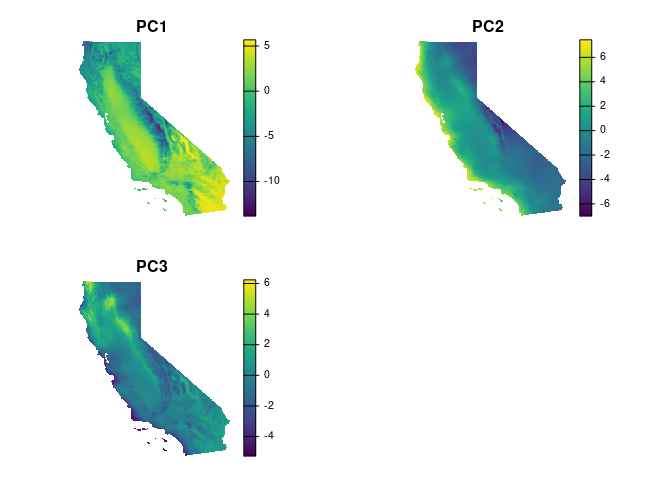
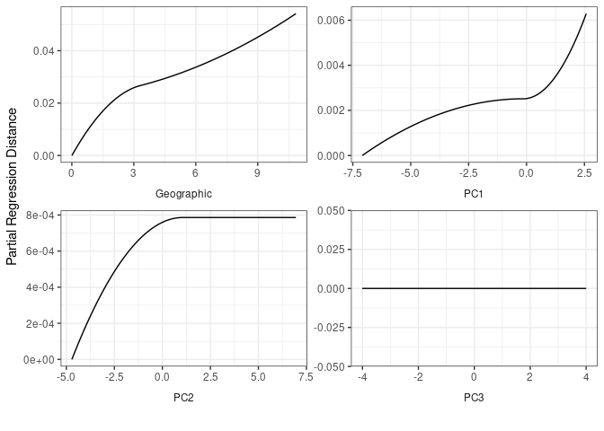
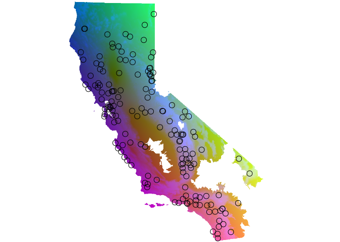
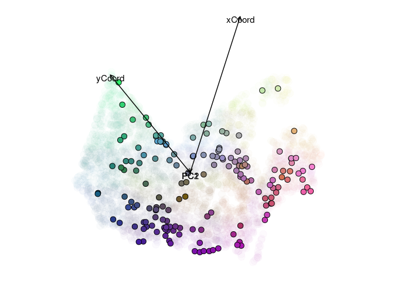
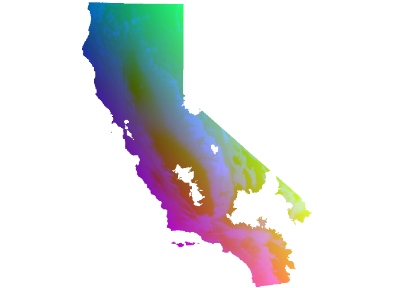
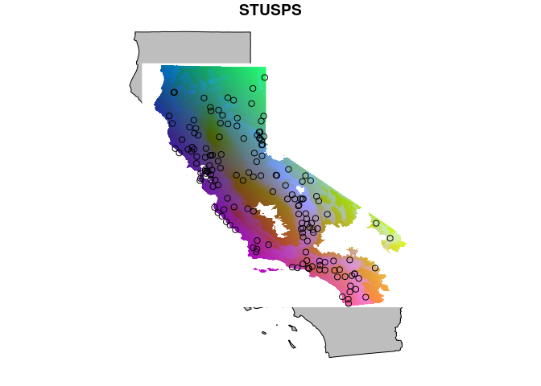
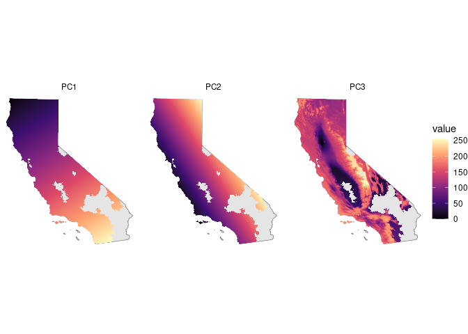
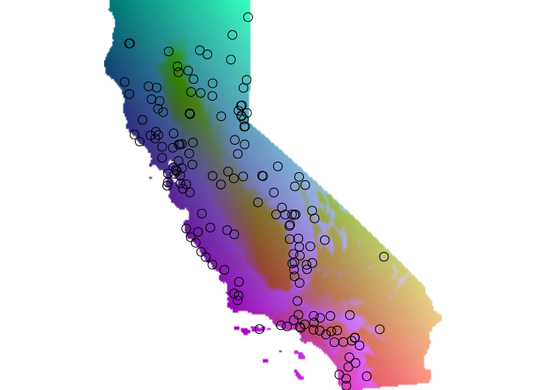
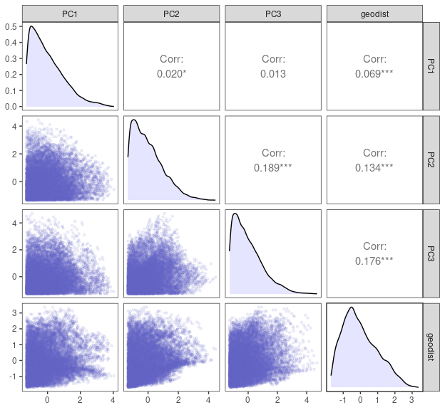

IBD/IBE analysis
================

# Format genetic distances

``` r
library(tidyverse)
library(here)
library(algatr)
library(terra)
library(sf)
source(here("general_functions.R"))
source(here("analysis", "ibdibe", "gendist.R"))
```

``` r
# Format distances and write out file
format_dist()
```

    ## wrote dist file to:/media/wanglab/798f0e01-89d1-4d0f-8ed8-ef323be70ab9/Anusha/GitHub/ccgpscelop/analysis/ibdibe/outputs/58-Sceloporus_dist.csv

``` r
ca <- get_ca()
```

    ## Retrieving data for the year 2021

``` r
coords <- get_coords()
```

    ## 
    ## ── Column specification ────────────────────────────────────────────────────────────────────────────────────────────────────────
    ## cols(
    ##   X1 = col_character(),
    ##   X2 = col_double(),
    ##   X3 = col_double()
    ## )

``` r
rm_inds <- c("JEM16-001-S14_na", "Scelocci_CCGPMC_MW01-3-14", "Scelocci_CHI1382_DAW5-46-21")
```

``` r
gendist <- get_gendist() 
gendist <- gendist[!rownames(gendist) %in% rm_inds, !colnames(gendist) %in% rm_inds]

gendist_coords <- 
  coords %>% 
  filter(SampleID %in% row.names(gendist)) %>%
  mutate(SampleID = factor(SampleID, levels = row.names(gendist))) %>%
  arrange(SampleID)

stopifnot(gendist_coords$SampleID == row.names(gendist))
```

``` r
envstack <- 
  rast(here("data", "env", "california_chelsa_bioclim_1981-2010_V.2.1_pca.tif")) %>%
  terra::project("epsg:3310")
env_agg <- mask(envstack, get_range())
```

    ## Reading layer `rWFLIx_CONUS_Range_2001v1' from data source 
    ##   `/media/wanglab/798f0e01-89d1-4d0f-8ed8-ef323be70ab9/Anusha/GitHub/ccgpscelop/data/rWFLIx_CONUS_HabMap_2001v1' 
    ##   using driver `ESRI Shapefile'
    ## Simple feature collection with 1 feature and 2 fields
    ## Geometry type: MULTIPOLYGON
    ## Dimension:     XY
    ## Bounding box:  xmin: -2361114 ymin: 1256270 xmax: -1319654 ymax: 3141656
    ## Projected CRS: NAD_1983_Albers

``` r
plot(envstack, axes = FALSE, box = FALSE)
```

<!-- -->

# GDM

``` r
coords_proj <- 
  gendist_coords[,c("x", "y")] %>% 
  st_as_sf(coords = c("x", "y"), crs = 4326) %>% 
  st_transform(3310)

env <- terra::extract(envstack, coords_proj, ID = FALSE)

gdm <- gdm_do_everything(gendist = gendist, coords = gendist_coords[,c("x", "y")], env = env, quiet = TRUE)
```

    ## Please be aware: the do_everything functions are meant to be exploratory. We do not recommend their use for final analyses unless certain they are properly parameterized.

    ## Warning in crs_check(coords, envlayers): No CRS found for the provided
    ## coordinates. Make sure the coordinates and the raster have the same projection
    ## (see function details or vignette)

``` r
print(gdm$coeff_df)
```

    ##    predictor  coefficient
    ## 1 Geographic 0.0544252909
    ## 2        PC1 0.0064262488
    ## 3        PC2 0.0007862327
    ## 4        PC3 0.0000000000

``` r
gdm_plot_isplines(gdm$model)
```

<!-- -->

``` r
maps <- gdm_map(gdm$model, env_agg, coords_proj, plot_vars = TRUE)
```

<!-- --><!-- -->

``` r
rgb_mask <- mask(maps$pcaRastRGB, get_range())
```

    ## Reading layer `rWFLIx_CONUS_Range_2001v1' from data source 
    ##   `/media/wanglab/798f0e01-89d1-4d0f-8ed8-ef323be70ab9/Anusha/GitHub/ccgpscelop/data/rWFLIx_CONUS_HabMap_2001v1' 
    ##   using driver `ESRI Shapefile'
    ## Simple feature collection with 1 feature and 2 fields
    ## Geometry type: MULTIPOLYGON
    ## Dimension:     XY
    ## Bounding box:  xmin: -2361114 ymin: 1256270 xmax: -1319654 ymax: 3141656
    ## Projected CRS: NAD_1983_Albers

``` r
plotRGB(rgb_mask)
```

<!-- -->

``` r
#rgb_envonly <- stack_to_rgb(maps$rastTrans[[3:5]])
#plotRGB(rgb_envonly)
#points(coords_proj, pch = 1, cex = 1)

plot(ca, col = "gray")
plotRGB(rgb_mask, add = TRUE)
points(coords_proj, pch = 1, cex = 1)
```

<!-- -->

``` r
ggmaps <- 
  as.data.frame(maps$pcaRastRGB, xy = TRUE) %>% 
  pivot_longer(cols = -c(x, y), names_to = "variable", values_to = "value")

ggplot(ggmaps) +
  geom_sf(data = st_transform(ca, 3310)) +
  geom_raster(aes(x = x, y = y, fill = value)) +
  facet_wrap(~variable, nrow = 1) +
  scale_fill_viridis_c(option = "magma", na.value = NA) +
  theme_void()
```

<!-- -->

# MMRR

``` r
coords_proj <- 
  gendist_coords[,c("x", "y")] %>% 
  st_as_sf(coords = c("x", "y"), crs = 4326) %>% 
  st_transform(3310)

env <- terra::extract(envstack, coords_proj, ID = FALSE)

mmrr <- mmrr_do_everything(gendist = gendist, coords = gendist_coords[,c("x", "y")], env = env, quiet = FALSE)
```

    ## Please be aware: the do_everything functions are meant to be exploratory. We do not recommend their use for final analyses unless certain they are properly parameterized.

    ## Warning in crs_check(coords): No CRS found for the provided coordinates. Make
    ## sure the coordinates and the raster have the same projection (see function
    ## details or vignette)

<!-- --><!-- --><!-- -->

``` r
print(mmrr$coeff_df)
```

    ##         var      estimate     p    95% Lower    95% Upper
    ## 1   geodist  7.639517e-01 0.001  0.754330744  0.773572647
    ## 2 Intercept  2.334300e-16 0.809 -0.009398416  0.009398416
    ## 3       PC1  8.103947e-02 0.001  0.071617507  0.090461425
    ## 4       PC2 -1.749408e-03 0.916 -0.011373124  0.007874309
    ## 5       PC3 -6.601251e-02 0.002 -0.075700564 -0.056324460

``` r
mmrr_df <- 
  dist_to_df(mmrr$Y, mmrr$X, stdz = TRUE) %>%
  mutate(var = 
    case_when(
      var == "geodist" ~ "Geographic distance",
      var == "PC1" ~ "Env. PC1 distance",
      var == "PC2" ~ "Env. PC2 distance",
      var == "PC3" ~ "Env. PC3 distance")
  )

mod_xy <- 
  mmrr_df %>%
  group_by(var) %>%
  summarize(X = max(X, na.rm = TRUE), Y = min(Y, na.rm = TRUE)) 

mod_df <- 
  mmrr$coeff_df %>% 
  mutate(estimate = round(estimate, 2)) %>%
  filter(var != "Intercept") %>%
  mutate(var = 
    case_when(
      var == "geodist" ~ "Geographic distance",
      var == "PC1" ~ "Env. PC1 distance",
      var == "PC2" ~ "Env. PC2 distance",
      var == "PC3" ~ "Env. PC3 distance")
  ) %>%
  left_join(mod_xy, by = "var")

png(here("analysis", "ibdibe", "plots", "mmrr.png"), width = 6.5, height = 6, units = "in", res = 300)
ggplot(mmrr_df, aes(x = X, y = Y)) +
  geom_hex(bins = 50) +
  scale_fill_viridis_c(option = "magma", na.value = NA) +
  geom_smooth(method = "lm", se = FALSE) +
  facet_wrap(~var, scales = "free") +
  geom_text(data = mod_df, aes(label = paste("Estimate:", estimate, "\n", "p:", p)), hjust = 1, vjust = -0.3, cex = 3.5) +
  labs(y = "Genetic distance", x = "Predictor distance") +
  theme_classic() +
  theme(
    strip.background = element_blank(),
    strip.text = element_text(size = 10))
```

    ## `geom_smooth()` using formula = 'y ~ x'

``` r
dev.off()
```

    ## png 
    ##   2

## Paleoclimate

``` r
envstack <- rast(here("data", "env", "paleoclim", "paleoclim.tif"))
lhstack <- envstack[[grepl("lh", names(envstack))]]
lhpcs <- RStoolbox::rasterPCA(lhstack, nComp = 3, scale = TRUE)
lhpcs <- lhpcs$map

coords_proj <- gendist_coords[,c("x", "y")] %>% st_as_sf(coords = c("x", "y"), crs = 4326) 
env <- terra::extract(lhpcs, coords_proj, ID = FALSE)

gdm_lh <- gdm_do_everything(gendist = gendist, coords = gendist_coords[,c("x", "y")], env = env, quiet = TRUE)

print(gdm_lh$coeff_df)

maps_lh <- gdm_map(gdm_lh$model, lhpcs, coords_proj, plot_vars = FALSE)

#rgb_envonly <- stack_to_rgb(maps_lh$rastTrans[[3:5]])
#rgb_envonly <- stack_to_rgb(maps_lh$rastTrans)
plotRGB(maps_lh$pcaRastRGB)
points(coords_proj, pch = 1, cex = 1)
```

``` r
curstack <- envstack[[grepl("cur", names(envstack))]]
curpcs <- RStoolbox::rasterPCA(curstack, nComp = 3, scale = TRUE)
curpcs <- curpcs$map

coords_proj <- gendist_coords[,c("x", "y")] %>% st_as_sf(coords = c("x", "y"), crs = 4326) 
env <- terra::extract(curpcs, coords_proj, ID = FALSE)

gdm_cur <- gdm_do_everything(gendist = gendist, coords = gendist_coords[,c("x", "y")], env = env, quiet = TRUE)

print(gdm_cur$coeff_df)

maps <- gdm_map(gdm_cur$model, curpcs, coords_proj, plot_vars = FALSE)
plotRGB(maps$pcaRastRGB)
points(coords_proj, pch = 1, cex = 1)
```

``` r
bio2 <- envstack[[grepl("lh_2", names(envstack))]]

coords_proj <- gendist_coords[,c("x", "y")] %>% st_as_sf(coords = c("x", "y"), crs = 4326) 
env <- terra::extract(bio2, coords_proj, ID = FALSE)

gdm_bio2 <- gdm_do_everything(gendist = gendist, coords = gendist_coords[,c("x", "y")], env = env, quiet = TRUE)

print(gdm_bio2$coeff_df)

maps <- gdm_map(gdm_bio2$model, bio2, coords_proj, plot_vars = FALSE)
plotRGB(maps$pcaRastRGB)
points(coords_proj, pch = 1, cex = 1)
print(gdm_bio2$coeff_df)
```

``` r
print(gdm_cur$coeff_df)
print(gdm_lh$coeff_df)
```
