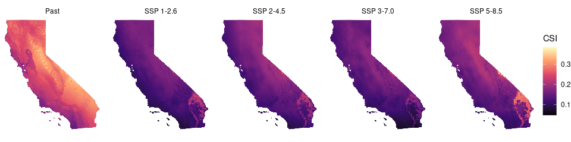
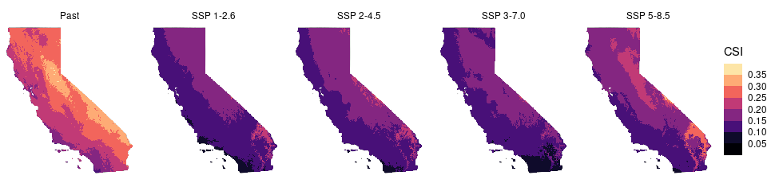
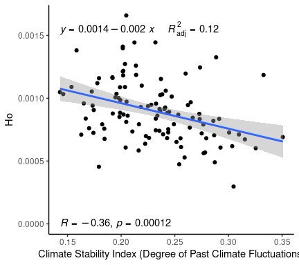
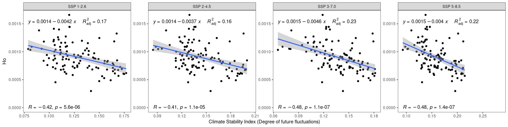
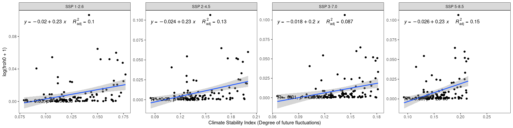

Climate Stability
================

Original paper: Herrando-Moraira, S., Nualart, N., Galbany-Casals, M. et
al. Climate Stability Index maps, a global high resolution cartography
of climate stability from Pliocene to 2100. Sci Data 9, 48 (2022).
<https://doi.org/10.1038/s41597-022-01144-5>

Note: Bioclimatic variables do not contain Bio 2 or Bio 5, but they do
contain other variables correlated with those variables

``` r
# get coords and genetic diversity data
het <- get_het()
roh <- get_roh()
coords <- get_coords(sf = TRUE) %>% left_join(het) %>% left_join(roh)
```

``` r
csi_past <- rast(here("data", "env", "stability", "Layers", "past", "csi_past.tif"))
csi_past <- crop(csi_past, ca)
csi_past <- mask(csi_past, ca)

files <- list.files(here("data", "env", "stability", "Layers", "future"), full.names = TRUE, pattern = "csi*")
csi_future <- rast(map(files, rast))
csi_future <- crop(csi_future, ca)
csi_future <- mask(csi_future, ca)

csi_stack <- c(csi_past, csi_future)
names(csi_stack) <- c("Past",  "SSP 1-2.6", "SSP 2-4.5", "SSP 3-7.0", "SSP 5-8.5")
csi_df <- terra::as.data.frame(csi_stack, xy = TRUE) %>% pivot_longer(-c(x, y), names_to = "model", values_to = "CSI")

ggplot(csi_df) +
  geom_sf(data = ca) +
  geom_raster(aes(x = x, y = y, fill = CSI)) +
  scale_fill_viridis_c(option = "magma", na.value = NA) + 
  facet_wrap(~model, nrow = 1) +
  theme_void() 
```

<!-- -->

``` r
value_range <- range(csi_df$CSI, na.rm = TRUE)
breaks <- seq(from = value_range[1], to = value_range[2], length.out = 11) # 10 breaks create 11 points
ggplot(csi_df) +
  geom_sf(data = ca) +
  geom_raster(aes(x = x, y = y, fill = CSI)) +
  scale_fill_stepsn(colours = viridis::magma(100), n.breaks = 10) +
  facet_wrap(~model, nrow = 1) +
  theme_void() 
```

<!-- -->

``` r
csi_vals <- extract(csi_past, coords, ID = FALSE)
df_past <- data.frame(csi_past = csi_vals[,1], coords)

ggplot(df_past, aes(x = csi_past, y = Ho)) +
  geom_point() +
  stat_regline_equation(
    aes(label =  paste(after_stat(eq.label), after_stat(adj.rr.label), sep = "~~~~")),
    formula = y ~ x
  ) +
  geom_smooth(method = "lm") +
  stat_cor(label.y = 0) +
  theme_classic() +
  xlab("Climate Stability Index (Degree of Past Climate Fluctuations)")
```

<!-- -->

``` r
csi_vals <- extract(csi_future, coords, ID = FALSE)
df_future <- 
  data.frame(csi_vals, coords) %>% 
  pivot_longer(starts_with("csi"), names_to = "future_model", values_to = "csi") %>%
  mutate(model_name = case_when(
    future_model == "csi_future_ssp126" ~ "SSP 1-2.6",
    future_model == "csi_future_ssp245" ~ "SSP 2-4.5",
    future_model == "csi_future_ssp370" ~ "SSP 3-7.0",
    future_model == "csi_future_ssp585" ~ "SSP 5-8.5"
  ))

ggplot(df_future, aes(x = csi, y = Ho)) +
  geom_point() +
  facet_wrap(~model_name, scales = "free", nrow = 1) +
  stat_regline_equation(
    aes(label = paste(after_stat(eq.label), after_stat(adj.rr.label), sep = "~~~~")),
    formula = y ~ x
  ) +
  geom_smooth(method = "lm") +
  stat_cor(label.y = 0) +
  theme_bw() +
  theme(panel.grid.major = element_blank(), panel.grid.minor = element_blank()) +
  xlab("Climate Stability Index (Degree of future fluctuations)")
```

<!-- -->

``` r
ggplot(df_future, aes(x = csi, y = log(froh0 + 1))) +
  geom_point() +
  facet_wrap(~model_name, scales = "free", nrow = 1) +
  stat_regline_equation(
    aes(label = paste(after_stat(eq.label), after_stat(adj.rr.label), sep = "~~~~")),
    formula = y ~ x
  ) +
  geom_smooth(method = "lm") +
  stat_cor(label.y = 0) +
  theme_bw() +
  theme(panel.grid.major = element_blank(), panel.grid.minor = element_blank()) +
  xlab("Climate Stability Index (Degree of future fluctuations)")
```

<!-- -->
