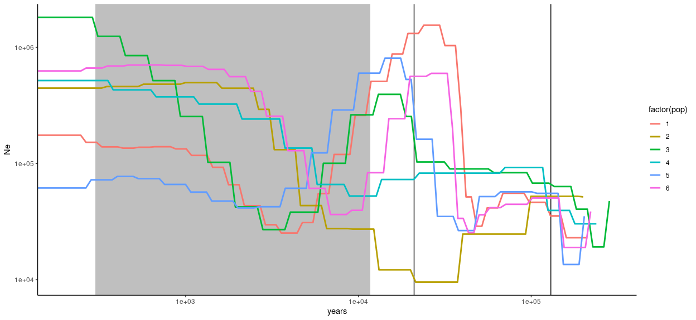

SMC++
================

  - [Single models](#single-models)
  - [Joint models](#joint-models)

# Single models

<!-- --><!-- -->

# Joint models

    ## [1] "Bay Area vs Southern California:"

    ## # A tibble: 3 × 2
    ##   T     years
    ##   <chr> <dbl>
    ## 1 1      22.8
    ## 2 2      45.5
    ## 3 3      68.3

    ## [1] "Bay Area vs Sierra Foothills:"

    ## # A tibble: 3 × 2
    ##   T     years
    ##   <chr> <dbl>
    ## 1 1      22.0
    ## 2 2      43.9
    ## 3 3      65.9

<!-- -->
